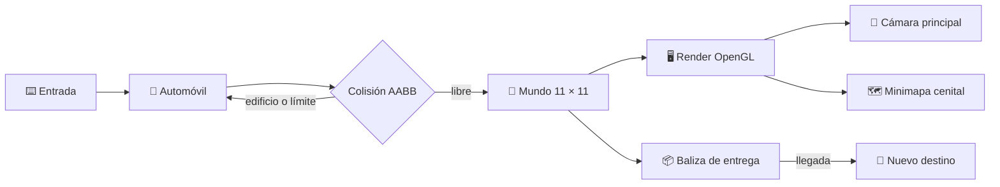

# 🌃 Ciudad Interactiva OpenGL

<p align="center">
  <strong>Una ciudad 3D explorable con misiones de entrega, iluminación dinámica y minimapa.</strong><br>
  Programación Gráfica · Java 17 · LWJGL 3.3.3 · OpenGL 3.3
</p>

<p align="center">
  
  
  
  
</p>

> [!TIP]
> El objetivo es conducir por la ciudad, seguir la baliza violeta y completar entregas sin atravesar edificios ni salir de los límites.

## ✨ Vista general

La ciudad está construida desde cero con cubos y shaders GLSL: no depende de modelos 3D, texturas ni motores externos. El escenario contiene una cuadrícula urbana de **11 × 11 celdas**, edificios con alturas variables, parques, calles, farolas, semáforos y pasos peatonales.



## 🎮 Controles

| Tecla | Acción |
| :---: | --- |
| `W` / `S` | Avanzar / retroceder |
| `A` / `D` | Girar a izquierda / derecha |
| `R` | Reiniciar posición y orientación del vehículo |
| `C` | Alternar cámara en tercera persona y orbital |
| `N` | Alternar ambiente de día / noche |
| `F` | Encender o apagar los dos faros delanteros |
| `M` | Mostrar u ocultar el minimapa |
| `Esc` | Cerrar la aplicación |

## 🧭 Funciones implementadas

### Ciudad y conducción

- Mapa ampliado a **11 × 11** con más de 12 manzanas de edificios y parques conectados por calles.
- Automóvil 3D controlable, con movimiento basado en `delta time` para conservar la misma velocidad a cualquier FPS.
- Colisiones AABB contra edificios y límites urbanos.
- Cámara en tercera persona y cámara orbital.

### Iluminación

- VBO de cubo completo: 36 vértices, posiciones `vec3` y normales unitarias `vec3`.
- Shader GLSL con luz ambiente, direccional y cálculo difuso a partir de normales reales.
- Modo nocturno con ventanas emisivas.
- Nueve farolas con atenuación cuadrática que iluminan las superficies cercanas.
- Dos faros direccionales que siguen la posición y orientación del automóvil.

### Vida urbana

- Parques con árboles formados por troncos y copas compuestas de cubos.
- Bancos urbanos de madera, pasos peatonales y edificios de distintas alturas y colores.
- Semáforos visuales animados en intersecciones: **rojo → verde → amarillo**.

### Misiones y minimapa

- Baliza violeta flotante y animada en una calle válida.
- Al alcanzar la baliza, se registra una entrega y se genera un destino aleatorio nuevo.
- El contador de entregas se actualiza en el título de la ventana.
- Minimapa cenital permanente (con `M` para ocultarlo), con norte hacia arriba, ciudad completa, auto orientado y destino activo.

## 🚀 Ejecutar el proyecto

### Requisitos

- [Java JDK 17](https://adoptium.net/)
- Apache Maven 3.9 o posterior
- Controladores de video compatibles con OpenGL 3.3

### Comandos

Desde la raíz del proyecto:

```powershell
mvn clean compile
mvn exec:java
```

En Windows, el `pom.xml` ya declara los binarios nativos de LWJGL necesarios. Si Maven no está reconocido, confirma la instalación con:

```powershell
java -version
mvn -version
```

## 🗂️ Estructura

```text
ciudad-interactiva-opengl/
├── pom.xml
├── README.md
└── src/
    └── main/
        └── java/
            └── com/
                └── graphics/
                    └── AppCiudad.java
```

## 🧩 Diseño técnico

| Área | Solución |
| --- | --- |
| Geometría | Un VAO/VBO reutilizable para cubos; cada objeto se transforma con su matriz de modelo. |
| Materiales | Color y emisión por uniforme; las ventanas incrementan la emisión nocturna. |
| Colisiones | Prueba AABB del automóvil contra las manzanas de edificios y contra `LIMITE`. |
| Iluminación | Normales transformadas en el vertex shader y suma de luz direccional, farolas y faros en el fragment shader. |
| Minimapa | Segunda pasada de render con `glViewport`, cámara cenital y proyección ortográfica. |
| Misiones | Selección aleatoria de una celda de calle; detección por radio de llegada. |

## ⚠️ Limitaciones conocidas

- Los semáforos son visuales: no detienen el vehículo, tal como permite la consigna.
- La colisión del vehículo usa una caja alineada a ejes para mantener el cálculo simple y predecible.
- No se utilizan texturas ni modelos externos; toda la escena se construye de forma procedimental con cubos y shaders.

## 👤 Autor

**Alejandro Caballero** · Proyecto académico de Programación Gráfica.

---

<p align="center">Hecho con ☕, Java y OpenGL.</p>
