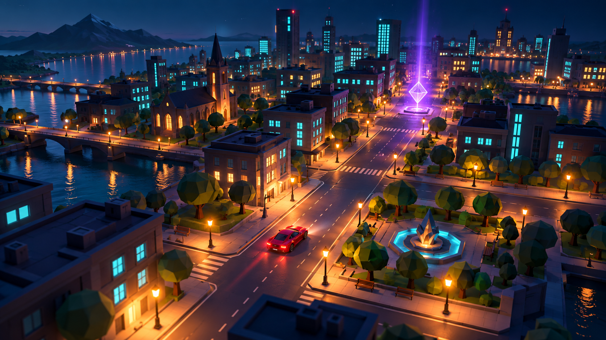
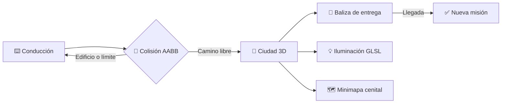

<p align="center">
  
</p>

<h1 align="center">🌃 Ciudad Interactiva OpenGL</h1>

<p align="center">
  <strong>Conduce. Explora. Completa entregas.</strong><br>
  Una ciudad 3D construida desde cero con Java, LWJGL y OpenGL.
</p>

<p align="center">
  
  
  
  
</p>

<p align="center">
  <a href="#-inicio-rápido">Inicio rápido</a> ·
  <a href="#-controles">Controles</a> ·
  <a href="#-experiencia-urbana">Funciones</a> ·
  <a href="#-arquitectura">Arquitectura</a>
</p>

---

> [!IMPORTANT]
> **Misión activa:** encuentra la baliza violeta, llega con el automóvil y recibe un nuevo destino. Todo mientras esquivas edificios, exploras parques y eliges entre la ciudad de día o de noche.

## ✨ ¿Qué hace especial a esta ciudad?

| 🌆 Mundo vivo | 💡 Luz que cambia | 🎯 Juego de entregas |
| :--- | :--- | :--- |
| 11 × 11 celdas conectadas, edificios de alturas variables, parques y pasos peatonales. | Día/noche, farolas con atenuación, faros direccionales y ventanas nocturnas emisivas. | Baliza 3D animada, destino aleatorio válido y contador de entregas actualizado. |



## 🚀 Inicio rápido

### 1. Requisitos

| Herramienta | Versión |
| --- | --- |
| Java JDK | 17 |
| Apache Maven | 3.9+ |
| GPU / driver | Compatible con OpenGL 3.3 |

### 2. Ejecutar

```powershell
git clone https://github.com/alecaballero17/ciudad-interactiva-opengl.git
cd ciudad-interactiva-opengl
mvn clean compile
mvn exec:java
```

> En Windows, el `pom.xml` ya incluye los binarios nativos de LWJGL requeridos para ejecutar la aplicación.

## 🎮 Controles

<table align="center">
  <tr><th>Tecla</th><th>Acción</th></tr>
  <tr><td><code>W</code> / <code>S</code></td><td>Avanzar / retroceder</td></tr>
  <tr><td><code>A</code> / <code>D</code></td><td>Girar el automóvil</td></tr>
  <tr><td><code>R</code></td><td>Reiniciar posición y orientación</td></tr>
  <tr><td><code>C</code></td><td>Alternar tercera persona / cámara orbital</td></tr>
  <tr><td><code>N</code></td><td>Alternar día / noche</td></tr>
  <tr><td><code>F</code></td><td>Encender o apagar faros</td></tr>
  <tr><td><code>M</code></td><td>Mostrar u ocultar minimapa</td></tr>
  <tr><td><code>Esc</code></td><td>Salir</td></tr>
</table>

## 🌇 Experiencia urbana

### 🏙️ Ciudad y conducción

- **Mapa expandido:** cuadrícula de 11 × 11 celdas, más de 12 manzanas construidas y múltiples parques conectados por calles.
- **Automóvil 3D:** controlado con `delta time`, con límites físicos y detección de colisiones AABB.
- **Dos cámaras:** una cámara de seguimiento para conducir y una orbital para apreciar el escenario completo.

### 💡 Iluminación que transforma la escena

```text
☀️ Día  → luz ambiental + direccional
🌙 Noche → farolas cálidas + ventanas emisivas + faros del auto
```

- VBO de cubo completo: **36 vértices**, posiciones `vec3` y normales unitarias `vec3`.
- Cálculo de luz difusa en GLSL a partir de las normales reales de cada superficie.
- Nueve farolas con atenuación cuadrática y dos focos delanteros orientados con el vehículo.

### 🌳 Detalles que le dan vida

| Parques | Edificios | Intersecciones |
| --- | --- | --- |
| Árboles con troncos y copas compuestas de cubos; bancos de madera. | Fachadas variables, techos y ventanas brillantes al anochecer. | Pasos peatonales y semáforos con ciclo rojo → verde → amarillo. |

### 🗺️ Minimapa y misiones

- Segunda pasada de render mediante `glViewport` y proyección ortográfica.
- Vista superior con norte hacia arriba, ciudad completa, marcador de orientación del auto y destino actual.
- Baliza violeta flotante y animada: al alcanzarla, se genera una nueva misión en una calle transitable.

## 🧩 Arquitectura

```text
src/main/java/com/graphics/AppCiudad.java
│
├── Inicialización GLFW + OpenGL
├── VAO / VBO reutilizable para todos los cubos
├── Shaders GLSL: iluminación, emisión y focos
├── Matriz urbana, edificios y colisiones AABB
├── Automóvil, cámaras y entrada por teclado
├── Decoración: parques, bancos, farolas y semáforos
└── Doble render: vista principal + minimapa
```

| Componente | Decisión de diseño |
| --- | --- |
| Geometría | Todos los objetos se componen de cubos transformados con su matriz de modelo. |
| Colisiones | Caja AABB del vehículo frente a edificios y límites urbanos. |
| Materiales | Uniformes de color y emisión; las ventanas incrementan brillo de noche. |
| Iluminación | Luz ambiental, direccional, 9 luces puntuales y 2 focos tipo spot. |
| Misiones | Selección aleatoria de una celda de calle y comprobación de distancia radial. |

## 🗂️ Estructura del repositorio

```text
ciudad-interactiva-opengl/
├── assets/
│   └── ciudad-interactiva-hero.png   # Ilustración de portada
├── src/main/java/com/graphics/
│   └── AppCiudad.java                # Aplicación completa
├── .gitignore
├── pom.xml
└── README.md
```

<details>
<summary><strong>⚠️ Limitaciones conocidas</strong></summary>
<br>

- Los semáforos tienen alcance visual, por lo que no detienen al automóvil.
- La colisión usa una caja alineada a los ejes para priorizar claridad y rendimiento.
- La ciudad se construye proceduralmente con cubos y shaders; no utiliza texturas ni modelos externos.
</details>

## 👤 Autor

<p align="center">
  <strong>Alejandro Caballero</strong><br>
  Proyecto académico · Programación Gráfica
</p>

<p align="center">
  <sub>Hecho con ☕, Java y OpenGL.</sub>
</p>
